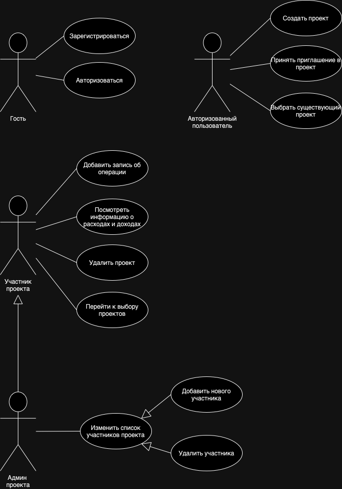
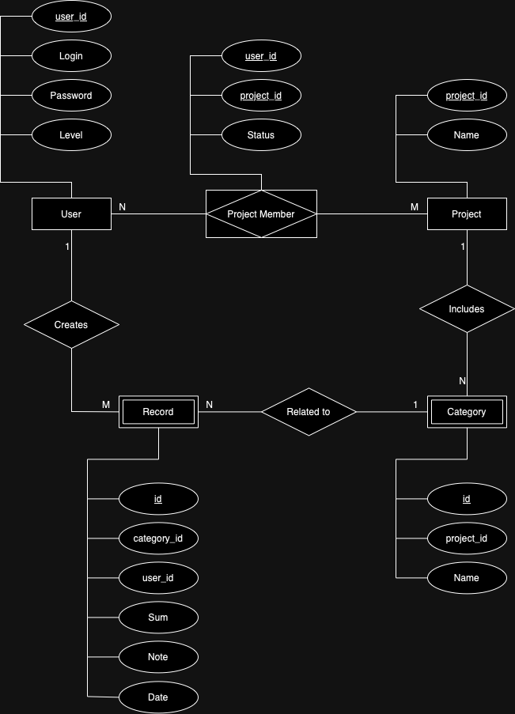

# Приложение для учета личных финансов

## Краткое описание идеи проекта
Разработка приложения, позволяющего вести учет личных финансов. После регистрации пользователь сможет создать несколько проектов для более удобного отслеживания расходов и доходов - семейный бюджет, личный бюджет, затраты на ремонт и так далее. В проекте пользователь сможет задать свой список категорий, добавлять записи об операциях, а также приглашать других пользователей для совместного учета общих финансов.

## Краткое описание предметной области
У каждого пользователя есть список проектов, в которых он может отслеживать финансы совместно с другими людьми. Если пользователь создает проект сам, он становится админом и может приглашать и удалять пользователей в своем проекте, изменять список категорий. Если пользователь принял приглашение в проект, он становится участником. И админ, и участник могут просматривать статистику расходов и доходов, а также добавлять записи с комментарием о новых операциях. Пользователь может сам выбирать период времени, за который он хочет посмотреть информацию об операциях. 

## Краткий анализ аналогичных решений

|  | Возможность изменять список категорий | Возможность разделить бюджет на несколько сфер | Возможность вести учет совместно с другими пользователями | Возможность самому задать период времени для вывода стастистики об операциях | Возможность комментировать операции|
|---|---|---|---|---|---|
|Money Lover | +  |  + |  + |  - | + |
|CoinKeeper  | +  |  - |  + |  - | + |
|Monefy      | +  |  - |  + |  + | + |

## Краткое обоснование целесообразности и актуальности проекта
Актуально для людей, которые хотят анализировать количество расходов и доходов по категориям, отслеживать финансовые дыры в своем бюджете. Подойдет людям, у которых несколько сфер расходов - семья, работа, путешествие и так далее. Удобно для пользователей, которым важна возможность разделения бюджета с другими людьми - членами семьи, коллегами.

## Краткое описание акторов
Акторы:
- Гость - незарегистрированный пользователь;
- Авторизованный пользователь - прошедший авторизацию или регистрацию пользователь на стадии выбора проекта;
- Участник проекта - авторизованный пользователь относительно проекта, в который он принял приглашение;
- Админ проекта - авторизованный пользователь относительно проекта, который он создал.

## Use-Case - диаграмма

## ER-диаграмма сущностей

## Пользовательские сценарии
Гость:
1. Зарегистрироваться
2. Авторизоваться

Авторизованный пользователь:
1. Выбрать проект
2. Создать свой проект
3. Принять приглашение в проект

Участник проекта:
1. Посмотреть список расходов и доходов за период времени
2. Добавить новую запись об операции
3. Выйти из проекта
4. Вернуться к выбору проектов

Админ проекта:
1. Посмотреть список расходов и доходов за период времени
2. Добавить новую запись об операции
3. Добавить новую категорию
4. Удалить категорию
5. Добавить нового участника в проект
6. Удалить участника из проекта
7. Удалить проект
8. Вернуться к выбору проектов

## Формализация ключевых бизнес-процессов

## Технологический стек
Тип приложения: Web SPA

Backend:
- ASP.NET Core
- C#

Frontend:
- React

Database:
- PostgreSQL
